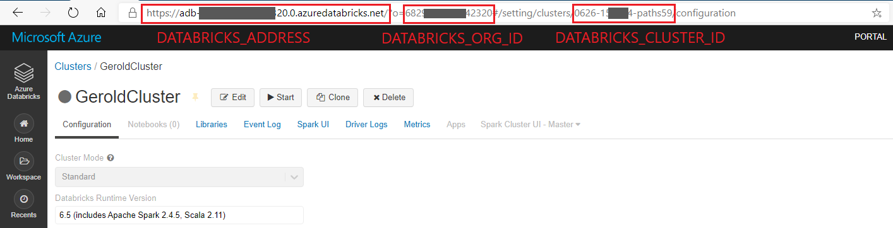

# Use Databricks from a local Virtual Studio Code

Databricks offers ready-to-start Spark clusters with customized notebooks. For many exploratory tasks, this is the way to go.
However, for production code it is often more desirable to have an IDE and to produce code in classical packages instead of notebooks.
This is especially the case when we want to properly modularize and test our software.

This manual describes how to connect Virtual Studio Code to a Databricks cluster. 
Thanks to the Docker container provided by Data Thirst Ltd. this has become much more convenient.

## Setup the cluster in Databricks

First you need to setup a Databricks workspace and create a cluster. Here is a description how to do this in MS Azure: https://docs.microsoft.com/en-us/azure/databricks/scenarios/quickstart-create-databricks-workspace-portal

The article proposes to create a cluster with 5.3 runtime. However, a higher runtime such as 6.5 might be more appropriate. Runtime 7 (Spark 3) is not yet supported by databricks-connect. (This information is valid at time of writing, check for updates)

After creating the cluster, go to its information page and write down the following information from the page-address:


On the same page, open the "Advanced Options" menu and under "Spark Config" add:
```
spark.databricks.service.server.enabled true
spark.databricks.service.port 8787
```

Now you need to create your DATABRICKS_API_TOKEN. Click on the user symbol in the upper right corner and chose "User Settings". Click on "Generate New Token". Give it a name such as "VS Code" and hit "Generate". Copy the token that appears. Be aware that this token will not be visible afterwards. If you forget the token, you will have to create a new one.


## Prepare VS Code
To connect your Databricks cluster the following requirements need to be fulfilled:
* Install the most recent version of VS Code
* Install Docker and start the Docker daemon
* Install the "Remote - Containers" Extension (or the "Remote Development" bundle in which it is included) in VS Code. 

Create a working directory and open the folder in VS Code. Within, create a directory `.devcontainer`. In this directory create a file named `devcontainer.json` with the following content (replace the secrets with the ones you noted down in the previous steps):
```json
{
    "context": "..",
    "image": "datathirstltd/dbconnect:6.5.1", // the version needs to match the version of the Databricks cluster

    "settings": {
        "python.pythonPath": "/opt/conda/envs/dbconnect/bin/python",
        "python.venvPath": "/opt/conda/envs/dbconnect/lib/python3.7/site-packages/pyspark/jars"
    },

    //  Optional command - could add your own environment.yml file here (you must keep --name the same)
    // "postCreateCommand": "conda env update --file environment.yml --name dbconnect",

    "containerEnv": {
        "DATABRICKS_ADDRESS": "<your databricks cluster address>",
        "DATABRICKS_CLUSTER_ID": "<your cluster ID>",
        "DATABRICKS_ORG_ID": "<your org ID>",
        "DATABRICKS_PORT": "8787"
    },
    "extensions": [
        "ms-python.python"
    ]
}
```

If you want to specify your conda environment (for example to install more python libraries), you can include an `environment.yml` file and uncomment the line starting with "postCreateCommand". Here is an example for an environment definition (make sure the version of databricks-connect matches the cluster version):
```
name: dbconnect
channels:
  - conda-forge
dependencies:
  - python=3.7.3
  - pip:
    - databricks-connect==6.5.1
    - six
    - pyarrow
    - pandas
    - databricks-cli
    - pylint
```


## Start the development container and begin coding
To start coding, click on the green symbol in the lower left corner of VS Code, then click on "Remote-Containers: Reopen in Containers". This will reopen the working directory inside the dbconnect Docker container. The first time it will take quite a while since the Docker container has to be downloaded.

To authenticate yourself, you need to provide your access token. This can be done via environment variables.
The preferred way would be to save the API key in a file such as `.setToken`:
```
export DATABRICKS_API_TOKEN=<your token>
```
Make sure to include this file in your .gitignore. With this token, everybody can access your cluster, it should therefore stay a secret!

Each time you start developing, you have to export the environment variable by running: `source .setToken`.

To check that everything works, run `databricks-connect test`. In case the Databricks cluster is not up, it will take a while to start.

If you make changes in the config files above, you need to rebuild the container. Click on the green symbol in the lower left corner and chose "Remote-Containers: Rebuild Containers".

You can now:
* create and modify files 
* use version control 
* run python scripts, including pytest or doctest, as usual

To fetch a Spark Context, use the following lines: 
```
from pyspark.sql import SparkSession
spark = SparkSession.builder.getOrCreate()
```
"Normal" python commands will be executed locally (or better: within the Docker container) but whenever you run Spark commands, they will be executed on the Databricks cluster. 
